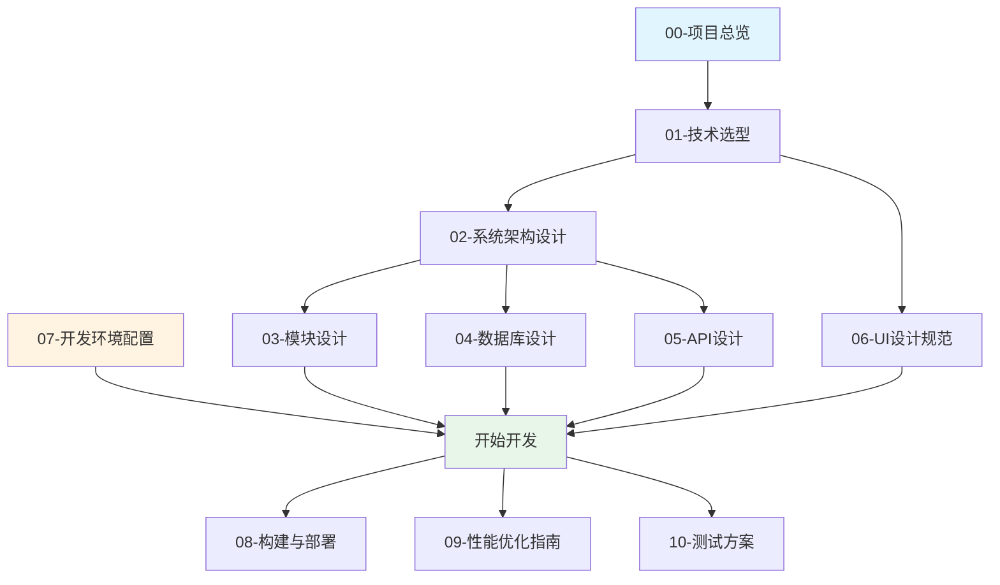

# CodeCanvas 开发文档

欢迎来到 **CodeCanvas** 桌面美化软件开发文档。本文档集提供了完整的技术规范、架构设计和开发指南。

## 📚 文档导航

### 基础文档

1. **[项目总览](./00-项目总览.md)** 🌟
   - 项目概述与核心功能
   - 设计目标与技术指标
   - 开发里程碑与团队分工
   - **新人必读**

2. **[技术选型](./01-技术选型.md)** 🔧
   - 整体技术架构（C++ + Vue）
   - 后端技术栈详解
   - 前端技术栈详解
   - IPC 通信设计
   - 依赖库选择与理由

### 架构设计

3. **[系统架构设计](./02-系统架构设计.md)** 🏗️
   - 分层架构图
   - 核心模块设计
   - 线程模型
   - 资源管理
   - 错误处理策略

4. **[模块设计](./03-模块设计.md)** 📦
   - Dock 栏模块详细设计
   - 壁纸管理模块详细设计
   - 虚拟桌宠模块详细设计
   - 模块间通信机制

### 数据层

5. **[数据库设计](./04-数据库设计.md)** 💾
   - SQLite 数据库架构
   - 表结构与索引
   - 数据访问层（DAO）
   - 迁移与备份策略

6. **[API 设计](./05-API设计.md)** 🔌
   - JSON-RPC 2.0 协议
   - 前后端通信接口
   - 事件通知机制
   - 错误码规范

### 用户界面

7. **[UI 设计规范](./06-UI设计规范.md)** 🎨
   - 设计系统（颜色、字体、间距）
   - 组件设计
   - 动画规范
   - 无障碍设计

### 开发实践

8. **[开发环境配置](./07-开发环境配置.md)** ⚙️
   - 系统要求
   - 工具安装指南
   - 项目设置
   - 常见问题解决
   - **开发必备**

9. **[构建与部署](./08-构建与部署.md)** 🚀
   - 完整构建流程
   - 打包与安装包制作
   - 代码签名
   - CI/CD 集成

10. **[性能优化指南](./09-性能优化指南.md)** ⚡
    - 性能目标与分析工具
    - C++ 性能优化技巧
    - 前端性能优化技巧
    - 性能监控

11. **[测试方案](./10-测试方案.md)** ✅
    - 测试策略
    - 单元测试（C++ & Vue）
    - 集成测试
    - E2E 测试
    - 性能测试

## 🚀 快速开始

### 对于新开发者

1. **了解项目**：阅读 [00-项目总览](./00-项目总览.md)
2. **理解架构**：浏览 [02-系统架构设计](./02-系统架构设计.md)
3. **搭建环境**：按照 [07-开发环境配置](./07-开发环境配置.md) 配置开发环境
4. **开始开发**：选择感兴趣的模块，参考 [03-模块设计](./03-模块设计.md)

### 对于前端开发者

重点阅读：
- [01-技术选型](./01-技术选型.md) - 前端技术栈部分
- [05-API设计](./05-API设计.md) - 前后端通信接口
- [06-UI设计规范](./06-UI设计规范.md) - UI/UX 规范

### 对于后端开发者

重点阅读：
- [01-技术选型](./01-技术选型.md) - 后端技术栈部分
- [02-系统架构设计](./02-系统架构设计.md) - 核心架构
- [03-模块设计](./03-模块设计.md) - 模块实现细节
- [04-数据库设计](./04-数据库设计.md) - 数据层设计

## 📖 阅读路线图



## 🎯 开发流程

1. **需求理解** → 阅读相关模块文档
2. **设计方案** → 参考架构设计文档
3. **编码实现** → 遵循代码规范
4. **单元测试** → 参考测试方案
5. **集成测试** → 验证模块协作
6. **性能优化** → 参考性能优化指南
7. **Code Review** → 团队审查
8. **提交代码** → 遵循 Git 规范

## 🛠️ 技术栈总览

### 后端（C++）
- **语言**：C++20
- **窗口系统**：Win32 API + Direct2D
- **渲染引擎**：DirectX 11
- **WebView**：Microsoft Edge WebView2
- **视频解码**：FFmpeg
- **数据库**：SQLite 3
- **日志**：spdlog
- **JSON**：nlohmann/json

### 前端（Vue）
- **框架**：Vue 3 + TypeScript
- **状态管理**：Pinia
- **构建工具**：Vite 5
- **动画**：GSAP
- **UI 组件**：自定义组件库

### 通信协议
- **IPC**：JSON-RPC 2.0 over WebView2

## 📝 代码规范

### C++
- **风格指南**：Google C++ Style Guide
- **格式化**：ClangFormat
- **命名约定**：
  - 类名：`PascalCase`
  - 函数名：`PascalCase`
  - 变量名：`camelCase`
  - 成员变量：`m_camelCase`
  - 常量：`UPPER_SNAKE_CASE`

### Vue/TypeScript
- **风格指南**：Vue 3 官方风格指南
- **格式化**：Prettier + ESLint
- **命名约定**：
  - 组件名：`PascalCase`
  - 函数名：`camelCase`
  - 常量：`UPPER_SNAKE_CASE`
  - CSS 类名：`kebab-case`

### Git Commit
遵循 [Conventional Commits](https://www.conventionalcommits.org/)：

```
<type>(<scope>): <subject>

<body>

<footer>
```

**类型（type）**：
- `feat`: 新功能
- `fix`: Bug 修复
- `docs`: 文档更新
- `style`: 代码格式调整
- `refactor`: 重构
- `perf`: 性能优化
- `test`: 测试相关
- `chore`: 构建/工具链更新

**示例**：
```
feat(dock): 添加应用拖拽排序功能

- 实现拖拽开始/结束事件处理
- 更新应用位置到数据库
- 添加拖拽动画效果

Closes #123
```

## 🤝 贡献指南

1. **Fork 项目**
2. **创建特性分支**：`git checkout -b feature/amazing-feature`
3. **提交更改**：`git commit -m 'feat: add amazing feature'`
4. **推送分支**：`git push origin feature/amazing-feature`
5. **创建 Pull Request**

### Code Review 清单

- [ ] 代码符合风格指南
- [ ] 添加了必要的注释
- [ ] 更新了相关文档
- [ ] 添加了单元测试
- [ ] 所有测试通过
- [ ] 无性能回归

## 📊 项目状态

| 模块 | 设计 | 实现 | 测试 | 文档 |
|------|------|------|------|------|
| 应用核心 | ✅ | ⏳ | ⏳ | ✅ |
| Dock 栏 | ✅ | ⏳ | ⏳ | ✅ |
| 壁纸管理 | ✅ | ⏳ | ⏳ | ✅ |
| 虚拟桌宠 | ✅ | ⏳ | ⏳ | ✅ |
| 设置界面 | ✅ | ⏳ | ⏳ | ✅ |

✅ 完成 | ⏳ 进行中 | ⭕ 未开始

## 🔗 相关资源

### 官方文档
- [Microsoft Docs - Win32 API](https://docs.microsoft.com/en-us/windows/win32/)
- [Microsoft Docs - Direct2D](https://docs.microsoft.com/en-us/windows/win32/direct2d/)
- [WebView2 Documentation](https://docs.microsoft.com/en-us/microsoft-edge/webview2/)
- [Vue 3 Documentation](https://vuejs.org/)
- [SQLite Documentation](https://www.sqlite.org/docs.html)

### 工具与库
- [vcpkg](https://github.com/microsoft/vcpkg)
- [CMake](https://cmake.org/documentation/)
- [FFmpeg](https://ffmpeg.org/documentation.html)
- [spdlog](https://github.com/gabime/spdlog)
- [nlohmann/json](https://github.com/nlohmann/json)
- [Google Test](https://github.com/google/googletest)

### 学习资源
- [Learn C++](https://www.learncpp.com/)
- [Modern C++ Tutorial](https://changkun.de/modern-cpp/)
- [Vue Mastery](https://www.vuemastery.com/)
- [TypeScript Handbook](https://www.typescriptlang.org/docs/)

## 📞 联系方式

- **项目负责人**：[待定]
- **技术负责人**：[待定]
- **邮箱**：codecanvas@example.com
- **Issue 跟踪**：GitHub Issues

## 📄 许可证

本项目采用 [MIT License](../LICENSE)

---

## 📅 更新日志

### v1.0.0 (2025-10-29)
- 📝 完成所有核心文档编写
- 🏗️ 确定技术架构
- 📐 完成模块设计
- 🎨 制定 UI 设计规范

---

**最后更新**：2025-10-29

**文档维护**：开发团队

如有疑问或建议，请提交 Issue 或联系技术负责人。

